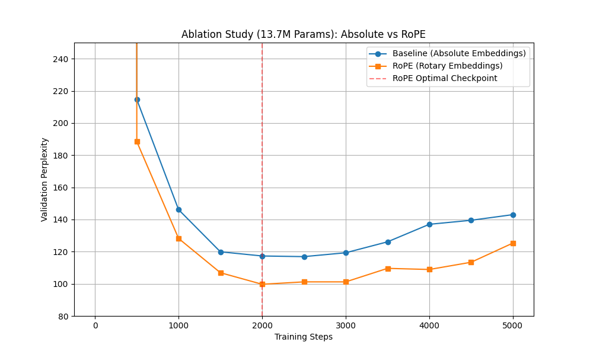

# GPT-from-Scratch: Architectural Ablation Study

This repository contains a custom-built, GPT-style Transformer language model written in PyTorch. 

Instead of a standard tutorial implementation, this project serves as an architectural ablation study comparing **Absolute Positional Embeddings** against **Rotary Position Embeddings (RoPE)** to evaluate impacts on validation perplexity.

## Key Engineering Features
* **Production Tokenization:** Replaced standard character-level encoding with OpenAI's `tiktoken` (BPE) to optimize sequence compression and handle a production-scale 50,257 vocabulary.
* **Modern Positional Awareness:** Implemented RoPE (used in LLaMA, Mistral, Gemma) from scratch to allow for better structural awareness and sequence scaling.
* **Rigorous Evaluation:** Replaced raw cross-entropy loss tracking with mathematical Perplexity ($e^{loss}$) evaluated on a strict train/validation split.

## The Ablation Study: Absolute vs. RoPE
To quantify the structural advantage of Rotary Position Embeddings, two models with identical parameter counts (13.7M) were trained on identical datasets. 

**Results (Optimal Checkpoints prior to overfitting):**
* **Baseline (Absolute Embeddings):** Minimum Val Perplexity: `116.9` (Step 2500)
* **RoPE (Rotary Embeddings):** Minimum Val Perplexity: `99.7` (Step 2000)


*The RoPE architecture mathematically outperformed the baseline, achieving a tighter probability distribution and breaking the sub-100 perplexity barrier.*

## How to Run Inference
Ensure you have `torch` and `tiktoken` installed.

```bash
python generate.py